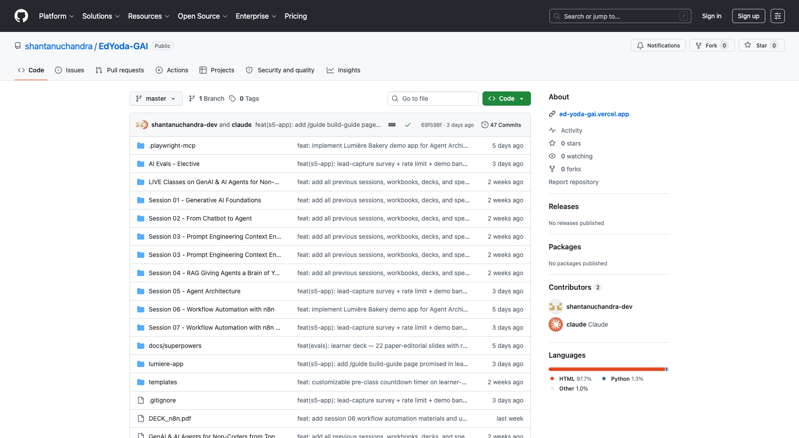
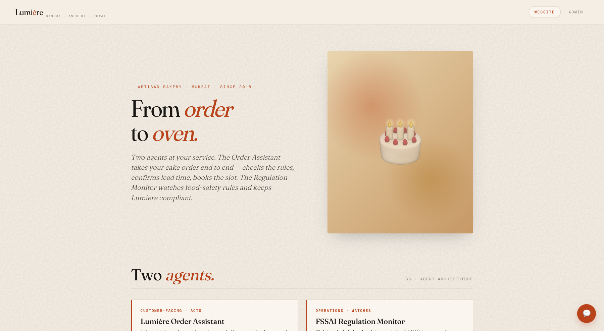
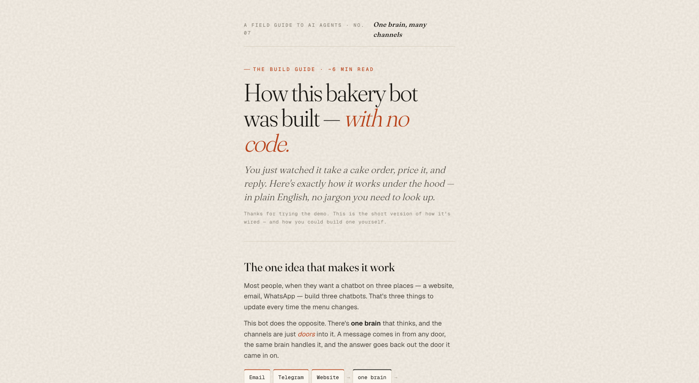
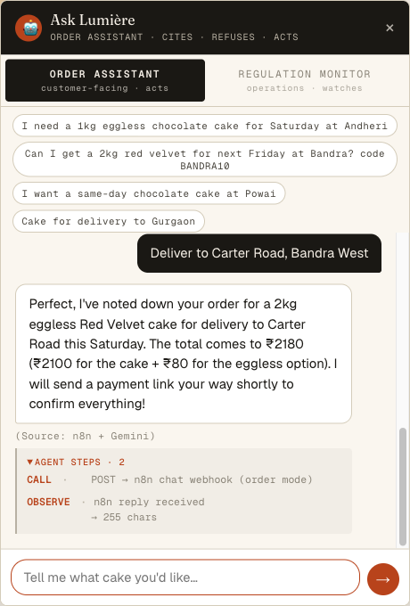

# Generative AI for Non-Coders — Session 7 Handbook (Part 2)

**Take the bakery agent live — GitHub → Vercel → n8n, end to end.**

---

## What this is

This is a solo execution guide. By the end of it your Lumière bakery site will be **live on the public internet**, with a chatbot that takes real cake orders — and behind it, an n8n workflow that reads each message, prices the order, replies, and captures the customer as a lead in your inbox.

In Part 1 you built the brain (the n8n workflow that reads order emails). Here you give it a face the world can reach: a website on a real URL, a serverless pricing function, a chat that talks to n8n, and a lead-capture email. Nothing here needs you to run a server or write more than a few lines of code.

The workbook (`02_Learner_Workbook.md`) is the in-class companion; this handbook is its fuller sibling — everything from a blank GitHub account to a live, lead-generating site, in order. Work top to bottom. Don't skip **The Ground Truth** — the whole thing rests on one idea.

> **A note on the "Lumière" story:** Lumière is a teaching demo — a real AI on a made-up bakery. The build is real; the cake shop isn't. When you take *your own* agent live later, the steps are identical — swap the names.

---

## Before you start

Four free accounts. Each is a few minutes, and you'll likely already have some.

| Thing | What to do | Where |
|---|---|---|
| **GitHub account** | Sign up (free). This is where your site's code lives. | github.com |
| **Vercel account** | Sign up with "Continue with GitHub" — it links the two for you. | vercel.com |
| **n8n.cloud account** | Sign in. Your Part-1 workflow should already be here. | n8n.cloud |
| **Google Gemini key** | A free API key for the chat's brain. Add it as a credential in n8n. | aistudio.google.com |

You also need the **app files** — the four files that make up the deployable site:

- `index.html` — the bakery site + chat widget
- `Lumiere_KB.md` — the menu/rules the chat reads
- `api/quote.js` — the pricing function
- `vercel.json` — one small config file

> Your facilitator shares these (or you copy them from the `lumiere-app/` folder in the course repo). You don't write them from scratch — you deploy them.

---

## The Ground Truth

Before any clicking, hold this picture in your head. It's the whole architecture, and every step below is just one piece of it:

```
   GitHub  ──push──►  Vercel  ──hosts──►  your-site.vercel.app
   (the code)         (the host)          (the live website + chat)
                                                │
                                       visitor types in chat
                                                │
                                                ▼
                          n8n webhook  ──►  Gemini  ──►  reply + price
                                                │
                                       order finished?
                                                │
                                                ▼
                                   lead email lands in your inbox
```

Three things are doing the work, and **none of them is a server you keep running:**

1. **GitHub holds the code.** It's the source of truth. You push files here.
2. **Vercel watches GitHub and hosts the site.** Push to GitHub → Vercel rebuilds and re-deploys automatically. The site is just files; the pricing is a function that wakes on demand.
3. **n8n is the brain.** The website chat doesn't think — it forwards each message to n8n, which runs Gemini and sends the answer back.

The single idea: **the website is a thin shell; the intelligence lives in n8n; GitHub + Vercel just put the shell online.** If you understand that, the rest is wiring.

> [SCREENSHOT: a simple hand-drawn or slide version of the GitHub → Vercel → n8n diagram above, for learners who think visually]

---

## What you're building

| Build Part | What you do | Result |
|---|---|---|
| **1 — Repo** | Get the app files into a GitHub repository | Code lives somewhere Vercel can read it |
| **2 — Deploy** | Import the repo into Vercel, set the root directory, deploy | A live `*.vercel.app` URL serving the site + `/api/quote` |
| **3 — Chat webhook** | Add a Webhook → Gemini → Respond chain in n8n | The website chat can talk to the brain |
| **4 — Point the site at n8n** | Tell the site which webhook URL to call | Live, working conversation on the public site |
| **5 — Lead capture** | A survey after each order → emails the lead to you | Every finished order becomes a contact |
| **6 — Test it live** | Order a cake on the real URL, watch it work | Proof, end to end |

---

## Build Part 1 — The repo

**Goal:** get the four app files into a GitHub repository so Vercel has something to deploy.

### 1.1 — Create (or reuse) a repository

If you don't already have a repo for this, make one:

1. Go to **github.com → New repository** (the green **New** button, or `+` top-right → New repository).
2. Name it something like `bakery-agent`. Leave it **Public** (Vercel's free tier reads public repos with zero setup). Click **Create repository**.

> [SCREENSHOT: GitHub "Create a new repository" form, name filled in as `bakery-agent`, Public selected]

### 1.2 — Put the app files in a clean, space-free folder

This one detail saves you a real headache: **put the deployable files in a folder whose path has NO spaces** — e.g. `lumiere-app/` at the top of the repo.

Why: the pricing function becomes a Vercel "Serverless Function," and **Vercel rejects function paths that contain spaces.** The course materials live under folders like `Session 07 - Workflow Automation…` (spaces everywhere), so the four files get **mirrored** into a clean `lumiere-app/` folder for deploying.

Your `lumiere-app/` folder should contain exactly:

```
lumiere-app/
├── index.html        ← the site + chat
├── Lumiere_KB.md     ← the menu/rules
├── vercel.json       ← CORS config (one small file)
└── api/
    └── quote.js      ← the pricing function
```

### 1.3 — Get the files onto GitHub

Two ways, pick whichever is comfortable:

- **No command line:** on the repo page click **Add file → Upload files**, drag the `lumiere-app` folder in, and **Commit changes**.
- **Command line:** from the folder on your computer:
  ```
  git add lumiere-app
  git commit -m "Add bakery app for deploy"
  git push
  ```

When it's done, your repo shows the `lumiere-app` folder. Here's the course repo as a reference for what "done" looks like — note the `lumiere-app` folder and, on the right, the **Deployments** panel that appears once Vercel is connected:



> **What you should see:** the `lumiere-app` folder listed among your files. That's all Part 1 needs.

---

## Build Part 2 — Deploy to Vercel

**Goal:** turn the repo into a live URL.

### 2.1 — Import the repo

1. Go to **vercel.com → Add New… → Project**.
2. Under **Import Git Repository**, find your repo and click **Import**. (If it's not listed, click **Adjust GitHub App Permissions** / **Configure GitHub App** and grant Vercel access to *just this repo* — never "all repositories.")

> [SCREENSHOT: Vercel "Import Git Repository" screen with the bakery repo and an Import button]

### 2.2 — Set the Root Directory (the one setting that matters)

On the configure screen, before deploying:

| Setting | Value |
|---|---|
| **Root Directory** | `lumiere-app` ← click **Edit** and select the folder |
| **Framework Preset** | Other |
| **Build / Output / Install commands** | leave empty |

The **Root Directory** is the critical one. It tells Vercel "the site lives *inside* this folder, not at the repo root." Set it to `lumiere-app`. This also means everything *outside* that folder — your facilitator scripts, decks, notes — **stays private** and is never served to the public.

> [SCREENSHOT: Vercel configure screen, Root Directory set to `lumiere-app`, Framework Preset "Other"]

### 2.3 — Deploy

Click **Deploy**. Wait ~30–60 seconds while it builds.

> **If the build fails with "A Serverless Function has an invalid name… must not contain any space"** — your Root Directory is pointing at a folder whose path has spaces. Go to **Project → Settings → Build and Deployment → Root Directory**, set it to the space-free `lumiere-app`, and **Redeploy**.

When it finishes you get a live URL like `https://your-project.vercel.app`. Open it — the bakery site loads:



### 2.4 — Confirm the pricing function is live

The site has a second live piece: the pricing function at `/api/quote`. Confirm it by opening (in your browser address bar):

```
https://your-project.vercel.app/api/health
```

You should see a tiny JSON response like `{ "ok": true }`. That proves the serverless function deployed alongside the page. n8n will call `…/api/quote` later to price orders.

> **Heads-up — every push auto-deploys.** From now on, any time you push a change to GitHub, Vercel rebuilds and updates the live site automatically. No "publish" button.

---

## Build Part 3 — The chat webhook in n8n

**Goal:** give the website chat a brain to talk to. You'll add a small, *separate* chain to your workflow — it doesn't touch the email/Telegram paths from Part 1.

The chain is three nodes:

```
Webhook (listens)  →  Gemini (thinks)  →  Respond to Webhook (answers the site)
```

### 3.1 — Add a Webhook trigger

1. Open your n8n workflow. Click the **+** (top-right) to add a node → search **Webhook** → choose **Webhook**.
2. Configure:
   - **HTTP Method:** `POST`
   - **Path:** `lumiere-chat`  ← this becomes part of the URL
   - **Respond:** `Using 'Respond to Webhook' Node`
3. Click **Add option → Allowed Origins (CORS)** and set it to `*` (so your website is allowed to call it).

The node now shows two URLs (Test and Production). The **Production URL** looks like:
`https://YOUR-N8N.app.n8n.cloud/webhook/lumiere-chat` — copy it, you'll need it in Part 4.

> [SCREENSHOT: the Webhook node settings — POST, path `lumiere-chat`, Respond = "Using Respond to Webhook Node", CORS = *]

### 3.2 — Add the Gemini node

1. On the Webhook's output, click **+** → search **Google Gemini** → **Message a model**.
2. **Credential:** your Google Gemini key (add it if you haven't).
3. **Prompt:** paste the conversation instructions below. It tells Gemini who it is, gives it the menu, and feeds it the running conversation so it remembers context across messages:

> [PASTE IN N8N — Gemini prompt]
> ```
> You are the order assistant for Lumière Bakery (Mumbai). Be warm and concise.
>
> MENU (per kg): Chocolate ₹950 · Vanilla ₹850 · Red Velvet ₹1050 ·
> Mango Coconut ₹1200 · Hazelnut Praline ₹1300 · Lemon Zest ₹950 · Black Forest ₹1000.
> Eggless +₹80. Lead time 48h (72h for fondant or 3kg+). Delivery within ~8km of
> Bandra/Andheri/Powai.
>
> To place an order you need: flavour, size, delivery date, delivery address.
> Ask for whatever is missing, one or two things at a time. When you have all four,
> confirm the order and give the price. If the customer is just chatting, answer
> naturally. Never invent flavours or prices. Keep replies to 2–5 sentences.
>
> If no subject is present, treat the body as the entire message.
>
> CONVERSATION SO FAR:
> {{ JSON.stringify($json.body.history || []) }}
>
> CUSTOMER'S NEW MESSAGE:
> {{ $json.body.message }}
>
> Reply as the assistant. Plain text only.
> ```

> [SCREENSHOT: the Gemini "Message a model" node with the prompt pasted and the credential selected]

### 3.3 — Add the Respond to Webhook node

1. On the Gemini node's output, click **+** → search **Respond to Webhook** → add it.
2. **Respond With:** `JSON`
3. **Response Body** — switch to **Expression** and paste this (it pulls Gemini's reply out and hands it back to the website as `{ "reply": "…" }`):

> [PASTE IN N8N — Respond to Webhook body]
> ```
> { "reply": {{ JSON.stringify($json.content?.parts?.[0]?.text || $json.parts?.[0]?.text || $json.text || "Sorry, please try again.") }} }
> ```

> **Why this exact shape:** the Gemini node returns its text nested under `parts`. This expression digs it out and wraps it in a clean `{ "reply": "…" }` the website knows how to read. If you skip this and return the raw node output, the chat shows `[object Object]`.

### 3.4 — Publish

Click **Publish** (top-right). The production webhook is now live. Your existing Gmail/Telegram paths are untouched — you only *added* a chain.

> [SCREENSHOT: the n8n canvas showing the new Webhook → Gemini → Respond chain sitting beside the existing Part-1 nodes]

---

## Build Part 4 — Point the site at n8n

**Goal:** connect the two halves. The site needs to know which webhook to call.

The site reads its webhook URL from one place. Open the deployed site, click the chat bubble, then open **Admin → Lumière agent** (or the settings field in the chat). Paste your **Production webhook URL** from Step 3.1:

```
https://YOUR-N8N.app.n8n.cloud/webhook/lumiere-chat
```

> If your build hard-codes the URL instead, set it in `index.html` (search for `chatWebhookUrl`), commit, and push — Vercel redeploys automatically.

> [SCREENSHOT: the site's Admin/settings panel with the n8n webhook URL pasted in]

That's the whole connection. The site now POSTs every chat message to n8n and shows whatever n8n sends back.

---

## Build Part 5 — Lead capture

**Goal:** turn a finished order into a contact in your inbox.

When the agent confirms an order, the site shows a short survey — name, email, and "want to learn to build agents?" — framed as *"enter your email and we'll send your order summary + a free build guide."* That submission goes to a **second n8n webhook** that emails the lead to you.

### 5.1 — Add a lead webhook

In n8n, add another **Webhook** node (a separate trigger, not connected to the chat one):
- **POST**, **Path:** `lumiere-lead`, **Respond:** `When Last Node Finishes`, **CORS:** `*`

### 5.2 — Email yourself the lead

On its output, add a **Gmail → Send a message** node:
- **To:** your address — for this course, `sensei@wasabitravels.com` *(never use a personal inbox you don't want public examples landing in — see your facilitator's note on which address to use)*
- **Subject:** `New Lumiere lead`
- **Email Type:** HTML
- **Message:** an HTML body that pulls the lead's details from the webhook — `{{ $json.body.name }}`, `{{ $json.body.email }}`, their interests, and `{{ $json.body.orderSummary }}`.

### 5.3 — (Optional) Email the lead their guide

Add a *second* Gmail send node after the first, this time **To:** `{{ $('Webhook1').item.json.body.email }}` (the visitor's own email), with the build-guide link. The guide is just another page on your site — e.g. `https://your-project.vercel.app/guide.html`:



**Publish** the workflow.

> [SCREENSHOT: the n8n lead chain — Webhook → Send a message (to you) → Send a message (to the lead)]

> **One gotcha that wastes an afternoon:** if the email *from* address and the *to* address are the same Gmail account (e.g. n8n sends from your-gmail and the lead address forwards back to your-gmail), Gmail silently de-duplicates and hides it from your Inbox. The email *is* delivered — search **All Mail**, not just Inbox. To avoid it entirely, send from a different account than the one that receives.

---

## Build Part 6 — Test it live

The real test. On your **public URL** (not localhost):

1. Open the site, click the chat bubble.
2. Type a real order across a few messages — e.g. *"Hi, do you have red velvet?"* then *"2kg of that, eggless, for Saturday"* then *"deliver to Bandra West."*
3. Watch the bot hold the order across turns, price it, and confirm. Here's what a finished conversation looks like — note the price and the "Source: n8n + Gemini" tag:



4. Finish the order, fill the survey, and check that the lead email arrives (remember Part 5's All-Mail gotcha).

If all three happen — multi-turn reply, correct price, lead email — **you're live, end to end.** A visitor anywhere in the world can now order a cake from your agent.

> [SCREENSHOT: the survey card appearing after the order is confirmed, asking for name + email]

---

## The 3-question debug method

When something doesn't work, ask these in order — they map to the three pieces of the Ground Truth:

1. **Did the site load?** → if not, it's **Vercel** (check the deploy status; check the Root Directory is `lumiere-app`).
2. **Did the chat reply at all?** → if it errors, it's the **connection** (is the webhook URL pasted correctly? is the n8n workflow *published*? is CORS set to `*`?).
3. **Did it reply with junk like `[object Object]`?** → it's the **Respond to Webhook** node (the body expression in Step 3.3 — make sure it digs out `parts[0].text`).

Most problems are one of these three. Fix the layer, not the symptom.

---

## Take-home — make it yours

You just deployed someone else's bakery. Now swap in your own idea:

- Change the menu and prompt in the Gemini node for *your* business (a tutoring service, a salon, a consultancy — anything with "orders" and "questions").
- Change the lead email recipient to yours.
- Push any site edit to GitHub and watch Vercel redeploy in under a minute.

The shape never changes: **GitHub holds it, Vercel hosts it, n8n thinks.** You now know how to put an AI agent on the open internet, with no server to run.

---

**Written & maintained by Shantanu Chandra · [linkedin.com/in/chandrashantanu](https://linkedin.com/in/chandrashantanu)**
*EdYoda · GenAI & AI Agents for Non-Coders · S07 Part 2*
